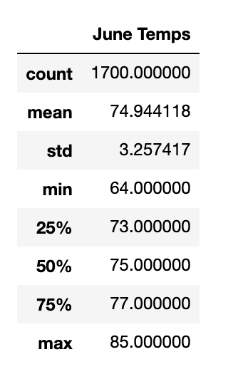
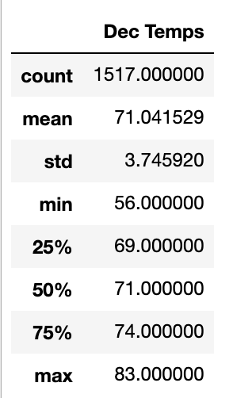

# Surfs_up

## Overview 

W. Avy, an investor who loves icecream and surfing, has partnered with a coder to analyze data for a potential surf and icecream shop in Hawaii. The data requested was related to the weather for a particular spot in Hawaii, such as temperature for particular days and preciptation. Using a combination of Python, Pandas, SQLite, and flask, we were able to pull the data from weather stations and analyze them for this venture. 

## Results 

The two requests made were for the average temperatures for June and December (both can be seen below). 

There are three key differences between June and December temperatures: 1) the average temperature in June is higher than in December, 2) the max temperature in June is higher than in December, and 3) the lowest temperature in December is much lower than in June. 

## Summary 

It is more likely that there will be a higher ice cream sales in June in December, and probably more surfboard rentals as well due to the higher temperatures in June. Other information that will be useful would be the amount of precipitation in June and December and the amount of sunny days in each month as well (precipation doesn't necessarily mean the whole day will be cloudy/rainy). This information could be useful in determining the amount of customers and/or revenue one could expect at the Surf and Icecream shop. 
